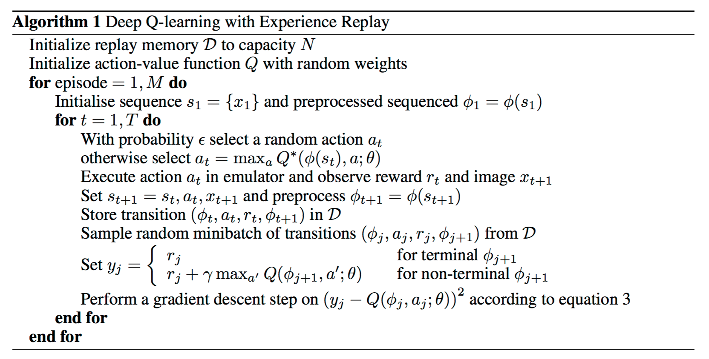

#DeepRL

This code implements the standard deep Q-learning and dueling network with Experience Replay for playing catch.

DQN algorithm implemented in this code is from the Google DeepMind's paper **Playing Atari with Deep Reinforcement Learning**[[link](https://www.cs.toronto.edu/~vmnih/docs/dqn.pdf)].

Dueling network is from the paper **Dueling Network Architectures for Deep Reinforcement Learning** [[link](https://arxiv.org/pdf/1511.06581v3)]

## Requirement

DeepRL is implemented with [Torch](http://torch.ch) and the packages of its ecosystem. This code is well worked on my Mac Pro with CPU (I haven't tested it on Linux and GPU). Install [Torch7](https://github.com/torch/torch7) firstly, then you should install the following packages by **luarocks**

```bash
luarocks install nn
luarocks install image
luarocks install qt
luarocks install optim
```

## Running

You can run this code by tapping the command in the project dir.

```lua
qlua main.lua
```

The result looks like


DQN: I got the accuracy of `93.2%` (932 success of 1000 epochs).
Duel: I got the accuracy of `99.2%` (992 success of 1000 epochs).


## Code 

The `envir.lua` indicates the environment in reinforcement learning stage, which receives the action and produces the states and a reward for agent.

The `agent.lua` is the implementation of agent which receives the states and reward to produce the action directed by the policy network.

The `learner.lua` is the learning algorithm of DQN with experience replay as the following.



## MISC

I completed this code when I was an intern at [Horizon Robotics](http://www.horizon-robotics.com/index_en.html). I will greatly thank the article of [Andrej Karpathy](https://karpathy.github.io/2016/05/31/rl/) and other implementations:[SeanNaren's code](https://github.com/SeanNaren/TorchQLearningExample) and [EderSantana's gist](https://gist.github.com/EderSantana/c7222daa328f0e885093).

## LICENSE
MIT